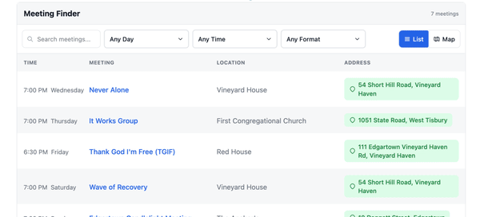

<p align="center">
  
</p>

<h1 align="center">Crumb Widget</h1>

<p align="center">
  <a href="https://github.com/bmlt-enabled/crumb-widget/actions/workflows/test.yml"></a>
  <a href="https://codecov.io/gh/bmlt-enabled/crumb-widget"></a>
  <a href="https://www.npmjs.com/package/crumb-widget"></a>
  <a href="https://crumb.bmlt.app/?lang=fi"></a>
</p>

<p align="center">
  🌐 <a href="https://github.com/bmlt-enabled/crumb-widget/">English</a> | <a href="README.es.md">Español</a> | <a href="README.pt-BR.md">Português (Brasil)</a> | <a href="README.fr.md">Français</a> | <a href="README.de.md">Deutsch</a> | <a href="README.it.md">Italiano</a> | <a href="README.sv.md">Svenska</a> | <a href="README.da.md">Dansk</a> | <a href="README.pl.md">Polski</a> | <a href="README.el.md">Ελληνικά</a> | <a href="README.ru.md">Русский</a> | <a href="README.ja.md">日本語</a> | Suomi | <a href="README.fa.md">فارسی</a>
</p>

<p align="center">
  <strong>👉 Demo:</strong> <a href="https://crumb.bmlt.app/meetings.html?lang=fi">crumb.bmlt.app/meetings.html?lang=fi</a>
</p>

<p align="center">
  
</p>

Verkkosivulle upotettava NA-kokoushaku. Rakennettu Svelte 5:llä ja jaettu yhtenä itsenäisenä JavaScript-tiedostona. Saatavilla [WordPress-lisäosana](https://wordpress.org/plugins/crumb/), [Drupal-moduulina](https://github.com/bmlt-enabled/crumb-drupal), [Joomla-laajennuksena](https://github.com/bmlt-enabled/crumb-joomla), [CDN-skriptinä](https://cdn.aws.bmlt.app/crumb-widget.js) tai [npm-pakettina](https://www.npmjs.com/package/crumb-widget).

## Mitä versiota minun pitäisi käyttää?

| Sivustosi                                                | Käytä tätä                                                                     |
| -------------------------------------------------------- | ------------------------------------------------------------------------------ |
| **WordPress**                                            | [WordPress-lisäosa](https://wordpress.org/plugins/crumb/)                      |
| **Drupal** 10.3+ tai 11                                  | [Drupal-moduuli](https://github.com/bmlt-enabled/crumb-drupal)                 |
| **Joomla** 4, 5 tai 6                                    | [Joomla-laajennus](https://github.com/bmlt-enabled/crumb-joomla)               |
| **Wix, Squarespace, Google Sites tai tavallinen HTML**   | Liitä [CDN-katkelma](#pika-aloitus) koodilohkoon                               |
| **JS/TS-sovellus** (React, Svelte, Vue, Vite tms.)       | `npm install crumb-widget` ([ohjeet](https://crumb.bmlt.app/?lang=fi#npm-package)) |

## Ominaisuudet

- Luettelo- ja karttanäkymät reaaliaikaisella haulla ja suodattimilla
- Kokouksen tiedot reittiohjeineen, verkkokokouksen liittymislinkkeineen ja formaatteineen
- Sijaintiin perustuva lähikokousten haku sekä paikkahaku kaupungin, postinumeron tai osoitteen perusteella
- Suorat linkit yksittäisiin kokouksiin sisäänrakennetun reitittimen avulla
- 14 sisäänrakennettua kieltä (English, Español, Português (Brasil), Français, Deutsch, Italiano, Svenska, Dansk, Polski, Ελληνικά, Русский, 日本語, Suomi, فارسی — mukaan lukien oikealta vasemmalle -asettelu persialle)
- Muokattavat sarakkeet, karttapohjat ja omat karttamerkit
- Valinnainen "Päivitä kokoustiedot" -linkki jokaisen kokouksen tiedoissa — ohjaa se [bmlt-workflow](https://github.com/bmlt-enabled/bmlt-workflow)-lomakkeeseen, mihin tahansa omaan lomakkeeseen tai `mailto:`-osoitteeseen — tai ilman asetuksia käytetään automaattisesti palveluelimen päivityslomaketta BMLT Server 4.2.9+:sta ([ohjeet](https://crumb.bmlt.app/?lang=fi#update-url))
- Tulostukseen sopiva luettelonäkymä

## Pika-aloitus

**Tarvitset:**

1. **BMLT-palvelimesi URL-osoitteen** — yleensä jotain tällaista: `https://bmlt.example.org/main_server/`. Kysy palveluelimesi verkkosivuvastaavalta, jos sinulla ei ole sitä.
2. (Valinnainen) **Palveluelimen tunnisteen**, jos haluat rajata kokoukset tiettyyn alueeseen. [Näin löydät sen →](https://crumb.bmlt.app/?lang=fi#find-service-body)

**Yksinkertaisin upotus** (liitä mille tahansa HTML-sivulle, Squarespacen koodilohkoon, Wixin HTML-upotukseen jne.):

```html
<div id="crumb-widget" data-server="https://myserver.com/main_server/"></div>
<script type="module" src="https://cdn.aws.bmlt.app/crumb-widget.js"></script>
```

**Rajaa yhteen palveluelimeen:**

```html
<div id="crumb-widget" data-server="https://myserver.com/main_server/" data-service-body="3"></div>
<script type="module" src="https://cdn.aws.bmlt.app/crumb-widget.js"></script>
```

## Dokumentaatio

Tutustu Crumbin koko dokumentaatioon — asetukset, esimerkit ja aloitusopas — osoitteessa **[crumb.bmlt.app](https://crumb.bmlt.app/?lang=fi)**.

## Tarvitsetko apua?

- 🐛 **Virhe tai ominaisuuspyyntö:** avaa issue [GitHubissa](https://github.com/bmlt-enabled/crumb-widget/issues)
- 📧 **Sähköposti:** [help@bmlt.app](mailto:help@bmlt.app)
- 💬 **Yhteisö:** [BMLT:n Facebook-ryhmä](https://www.facebook.com/groups/bmltapp/)

## Lisenssi

MIT
