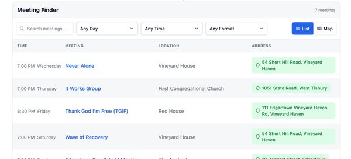

<p align="center">
  
</p>

<h1 align="center">Crumb Widget</h1>

<p align="center">
  <a href="https://github.com/bmlt-enabled/crumb-widget/actions/workflows/test.yml"></a>
  <a href="https://codecov.io/gh/bmlt-enabled/crumb-widget"></a>
  <a href="https://www.npmjs.com/package/crumb-widget"></a>
  <a href="https://crumb.bmlt.app/?lang=pl"></a>
</p>

<p align="center">
  🌐 <a href="https://github.com/bmlt-enabled/crumb-widget/">English</a> | <a href="README.es.md">Español</a> | <a href="README.pt-BR.md">Português (Brasil)</a> | <a href="README.fr.md">Français</a> | <a href="README.de.md">Deutsch</a> | <a href="README.it.md">Italiano</a> | <a href="README.sv.md">Svenska</a> | <a href="README.da.md">Dansk</a> | Polski | <a href="README.el.md">Ελληνικά</a> | <a href="README.ru.md">Русский</a> | <a href="README.ja.md">日本語</a> | <a href="README.fa.md">فارسی</a>
</p>

<p align="center">
  <strong>👉 Demo na żywo:</strong> <a href="https://crumb.bmlt.app/meetings.html?lang=pl">crumb.bmlt.app/meetings.html?lang=pl</a>
</p>

<p align="center">
  
</p>

Osadzalny widżet wyszukiwarki spotkań NA. Zbudowany przy użyciu Svelte 5 i dystrybuowany jako pojedynczy, samowystarczalny plik JavaScript. Dostępny jako [wtyczka WordPress](https://wordpress.org/plugins/crumb/), [moduł Drupal](https://github.com/bmlt-enabled/crumb-drupal), [rozszerzenie Joomla](https://github.com/bmlt-enabled/crumb-joomla), [skrypt CDN](https://cdn.aws.bmlt.app/crumb-widget.js) lub [pakiet npm](https://www.npmjs.com/package/crumb-widget).

## Której wersji powinienem użyć?

| Twoja strona                                              | Użyj tego                                                                |
|-----------------------------------------------------------|--------------------------------------------------------------------------|
| **WordPress**                                             | [wtyczka WordPress](https://wordpress.org/plugins/crumb/)                |
| **Drupal** 10.3+ lub 11                                   | [moduł Drupal](https://github.com/bmlt-enabled/crumb-drupal)             |
| **Joomla** 4, 5 lub 6                                     | [rozszerzenie Joomla](https://github.com/bmlt-enabled/crumb-joomla)      |
| **Wix, Squarespace, Google Sites lub zwykły HTML**        | Wklej [fragment CDN](#szybki-start) do bloku kodu                        |
| **Aplikacja JS/TS** (React, Svelte, Vue, Vite itp.)       | `npm install crumb-widget` ([dokumentacja](https://crumb.bmlt.app/?lang=pl#npm-package)) |

## Funkcje

- Widoki listy i mapy z wyszukiwaniem i filtrami w czasie rzeczywistym
- Szczegóły spotkania z trasą dojazdu, linkiem do dołączenia wirtualnego i formatami
- Wyszukiwanie pobliskich spotkań na podstawie geolokalizacji
- Linki do pojedynczych spotkań przez wbudowany router
- 13 wbudowanych języków (English, Español, Português (Brasil), Français, Deutsch, Italiano, Svenska, Dansk, Polski, Ελληνικά, Русский, 日本語, فارسی — w tym układ RTL dla perskiego)
- Konfigurowalne kolumny, kafelki mapy i niestandardowe znaczniki
- Widok listy przyjazny dla drukarki

## Szybki start

**Czego będziesz potrzebować:**

1. Adresu URL **serwera BMLT** — zwykle wygląda jak `https://bmlt.example.org/main_server/`. Zapytaj webserwanta swojego service body, jeśli go nie masz.
2. (Opcjonalnie) **ID service body**, aby filtrować do konkretnego obszaru lub regionu. [Jak je znaleźć →](https://crumb.bmlt.app/?lang=pl#find-service-body)

**Minimalne osadzenie** (wklej na dowolnej stronie HTML, w bloku kodu Squarespace, w osadzeniu HTML w Wix itp.):

```html
<div id="crumb-widget" data-server="https://myserver.com/main_server/"></div>
<script type="module" src="https://cdn.aws.bmlt.app/crumb-widget.js"></script>
```

**Filtrowanie do pojedynczego service body:**

```html
<div id="crumb-widget"
    data-server="https://myserver.com/main_server/"
    data-service-body="3"
></div>
<script type="module" src="https://cdn.aws.bmlt.app/crumb-widget.js"></script>
```

## Dokumentacja

Zapoznaj się z pełną dokumentacją Crumb — w tym opcjami konfiguracji, przykładami i przewodnikiem wprowadzającym na **[crumb.bmlt.app](https://crumb.bmlt.app/?lang=pl)**.

## Potrzebujesz pomocy?

- 🐛 **Błąd lub propozycja funkcji:** otwórz zgłoszenie na [GitHub](https://github.com/bmlt-enabled/crumb-widget/issues)
- 📧 **E-mail:** [help@bmlt.app](mailto:help@bmlt.app)
- 💬 **Społeczność:** [grupa BMLT na Facebooku](https://www.facebook.com/groups/bmltapp/)

## Licencja

MIT
