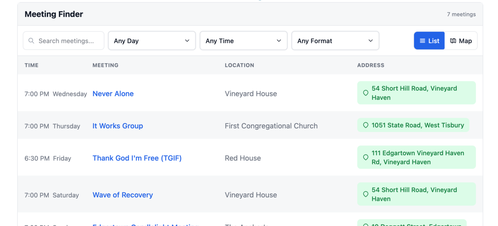
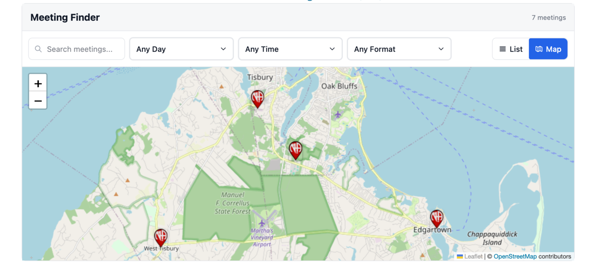

<p align="center">
  
</p>

<h1 align="center">Crumb Widget</h1>

<p align="center">
  <a href="https://github.com/bmlt-enabled/crumb-widget/actions/workflows/test.yml"></a>
  <a href="https://codecov.io/gh/bmlt-enabled/crumb-widget"></a>
  <a href="https://www.npmjs.com/package/crumb-widget"></a>
  <a href="https://crumb.bmlt.app/?lang=sv"></a>
</p>

<p align="center">
  🌐 <a href="https://github.com/bmlt-enabled/crumb-widget/">English</a> | <a href="README.es.md">Español</a> | <a href="README.pt-BR.md">Português (Brasil)</a> | <a href="README.fr.md">Français</a> | <a href="README.de.md">Deutsch</a> | <a href="README.it.md">Italiano</a> | Svenska | <a href="README.da.md">Dansk</a> | <a href="README.pl.md">Polski</a> | <a href="README.el.md">Ελληνικά</a> | <a href="README.ru.md">Русский</a> | <a href="README.ja.md">日本語</a> | <a href="README.fa.md">فارسی</a>
</p>

<p align="center">
  <strong>👉 Livedemo:</strong> <a href="https://crumb.bmlt.app/meetings.html?lang=sv">crumb.bmlt.app/meetings.html?lang=sv</a>
</p>

<p align="center">
  
  
</p>

En inbäddningsbar widget för att hitta NA-möten. Byggd med Svelte 5 och distribuerad som en fristående JavaScript-fil. Tillgänglig som [WordPress-plugin](https://wordpress.org/plugins/crumb/), [Drupal-modul](https://github.com/bmlt-enabled/crumb-drupal), [CDN-skript](https://cdn.aws.bmlt.app/crumb-widget.js) eller [npm-paket](https://www.npmjs.com/package/crumb-widget).

## Vilken version ska jag använda?

| Din webbplats                                           | Använd detta                                                             |
|---------------------------------------------------------|--------------------------------------------------------------------------|
| **WordPress**                                           | [WordPress-plugin](https://wordpress.org/plugins/crumb/)                 |
| **Drupal** 10.3+ eller 11                               | [Drupal-modul](https://github.com/bmlt-enabled/crumb-drupal)             |
| **Wix, Squarespace, Google Sites eller ren HTML**       | Klistra in [CDN-snutten](#snabbstart) i ett kodblock                     |
| **En JS/TS-app** (React, Svelte, Vue, Vite osv.)        | `npm install crumb-widget` ([dokumentation](https://crumb.bmlt.app/?lang=sv#npm-package)) |

## Funktioner

- List- och kartvyer med realtidssökning och filter
- Mötesdetaljer med vägbeskrivning, länk för virtuellt deltagande och format
- Geolokationsbaserad sökning efter närliggande möten
- Individuella möteslänkar via inbyggd router
- 13 inbyggda språk (English, Español, Português (Brasil), Français, Deutsch, Italiano, Svenska, Dansk, Polski, Ελληνικά, Русский, 日本語, فارسی — inklusive RTL-layout för persiska)
- Konfigurerbara kolumner, kartrutor och anpassade markörer
- Utskriftsvänlig listvy

## Snabbstart

**Vad du behöver:**

1. Din **BMLT-server-URL** — vanligtvis något i stil med `https://bmlt.example.org/main_server/`. Fråga din service bodys webbansvarige om du inte har den.
2. (Valfritt) Ett **service body-ID** för att filtrera till ett specifikt område eller en region. [Så hittar du det →](https://crumb.bmlt.app/?lang=sv#find-service-body)

**Minimal inbäddning** (klistra in på vilken HTML-sida som helst, Squarespace-kodblock, Wix HTML-inbäddning osv.):

```html
<div id="crumb-widget" data-server="https://myserver.com/main_server/"></div>
<script type="module" src="https://cdn.aws.bmlt.app/crumb-widget.js"></script>
```

**Filtrera till en enskild service body:**

```html
<div id="crumb-widget"
    data-server="https://myserver.com/main_server/"
    data-service-body="3"
></div>
<script type="module" src="https://cdn.aws.bmlt.app/crumb-widget.js"></script>
```

## Dokumentation

Kolla in den fullständiga Crumb-dokumentationen — inklusive konfigurationsalternativ, exempel och en guide för att komma igång på **[crumb.bmlt.app](https://crumb.bmlt.app/?lang=sv)**.

## Behöver du hjälp?

- 🐛 **Bugg eller funktionsförfrågan:** öppna ett ärende på [GitHub](https://github.com/bmlt-enabled/crumb-widget/issues)
- 📧 **E-post:** [help@bmlt.app](mailto:help@bmlt.app)
- 💬 **Community:** [BMLT Facebook-grupp](https://www.facebook.com/groups/bmltapp/)

## Licens

MIT
